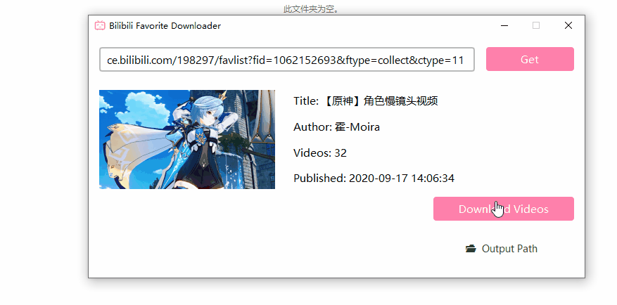

# Bilibili 收藏夹下载器

基于 [annie](https://github.com/iawia002/annie) 和 PyQt6 实现批量下载 Bilibili 指定收藏夹下的视频

界面~~参考~~（抄） [amarjeetmalpotra/yt-downloader](https://github.com/amarjeetmalpotra/yt-downloader) 的代码

## Preview

| 描述     | 图片                     |
|----------|-------------------------|
| 初始界面 |     |
| 搜索过程 |  |
| 搜索结果 |     |
| 下载过程 |  |

## Installation

```Bash
git clone https://github.com/taseikyo/bili-favorite-downloader.git

# install PyQt6
pip install pyqt6

# install annie & ffmpeg
scoop install annie ffmpeg

# run the app
cd bili-favorite-downloader
python app.py
```

默认是多线程同时下载所有视频，可以修改为单线程下载（即下完一个再下第二个）

具体操作为将 `DownloadThread` 类的 `is_multithreads`（[150 行左右](https://github.com/taseikyo/bili-favorite-downloader/blob/master/app.py#L150)）改为 `False` 即可

还没有进行充分的测试，不知道会不会有什么问题（）

## License

Copyright (c) 2021 Lewis Tian. Licensed under the MIT license.
